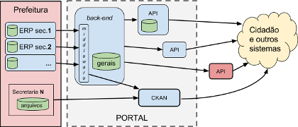

# backend-portal-transparencia
Recomendações técnicas gerais para o *back-end* de um "Portal da Transparência" de um município brasileiro, elaboradas colaborativamente por um coletivo de cidadãos interessados e conhecedores do tema; e recomendações detalhadas para o município de São Paulo, onde [houve recentemente consulta pública e previsão de licitação](http://www.prefeitura.sp.gov.br/cidade/secretarias/controladoria_geral/noticias/?p=217291).

# Introdução

A obrigatoriedade da publicação dos dados contábeis teve a sua origem nas Leis Complementares [nº 101 de 2000](http://www.lexml.gov.br/urn/urn:lex:br:federal:lei.complementar:2000-05-04;101) ("Lei de Responsabilidade Fiscal")   e [nº 131 de 2009](http://www.lexml.gov.br/urn/urn:lex:br:federal:lei.complementar:2009-05-27;131), depois reforçadas com a [Lei do Acesso à informação em 2011](http://www.lexml.gov.br/urn/urn:lex:br:federal:lei:2011-11-18;12527) (LAI). Em resposta a tais exigências, o poder executivo de diversos municípios passou a manter na Internet o que se convencionou chamar **Portal da Transparência do município**.

Para responder à pergunta «&#160;Quais os requisitos obrigatórios (por lei) do *Portal da Transparência*?&#160;» seria necessário revisar todas as obrigações expressas pelas leis federais citadas, pelos [decretos adicionais](http://www.portaldatransparencia.gov.br/sobre/Legislacao.asp) e ainda pelas demais normas que incidem sobre os municípios, o que foge ao escopo da deste projeto: estamos supondo que tais elementos já se encontram consolidados em diversos estudos (ver referências), cabendo à presente iniciativa apenas resumi-los.

Além dos requisitos obrigatórios, há uma série de "requisitos voluntários" já consagrados na concepção de um *Portal da Transparência*, a serem também levados em conta:

* "requisitos das prefeituras" expressos na estrutura que se repete na maior parte dos portais,
* "[requisitos do cidadão](http://cafehacker.prefeitura.sp.gov.br/tag/portal-da-transparencia/)" obtidos dos mais diversos levantamentos,
* requisitos dos orgãos de fiscalização, tais como a Controladorias Gerais dos Municípios (CGMs).

As recomendações [da presente iniciativa](https://github.com/CPT-PC/backend-portal-transparencia) levam em conta todos esses requisitos, obrigatórios e voluntários.

## Escopo
Apesar da complexidade do tema, há como se expressar e discutir o assunto com base em alguns conceitos norteadores:

> O governo municipal precisa ser ***transparente*** quanto aos seus ***atos*** e as suas ***contas***. Transparente no sentido de "*publicar* para todo mundo ver" e também "para poder ser *auditado* por todos".

* **Transpante**: significa que dados e conteúdos são simultaneamente  *publicados* no Diário Oficial e na Internet, cumprindo o amplo acesso previsto pela LAI. Para "poder ser [*auditado*](https://www.wikidata.org/wiki/Q181487)", requer também que os dados e conteúdos estejam em [formatos abertos](http://5stardata.info/pt-BR/), e que haja *consistência* entre os diversos itens de dados, metadados ou conteúdos publicados (ver ilustração abaixo).

* **Atos**: leis, decretos, portarias, licitações e contratos, são *atos*, expressos na forma de documentos, podendo originar simultaneamento conteúdos (ex. texto), dados (ex. tabelas) e metaddos (extraídos do texto ou complementando ele).
   * Os metadados permitem auditar a consistência entre *atos* e *contas*, além de identificar univocamente cada *ato* e formalizar outros relacionamentos.
   * O conteúdo tem  os requisitos jurídicos resolvidos com a publicação no [Diário Oficial](https://www.wikidata.org/wiki/Q2065227) (PDF). 
   * A *transparência* do conteúdo fica completa com a publicação na Internet (HTML), apoiada pelo uso dos metadados  (publicação no [LexML](http://www.lexml.gov.br/)).
  
* **Contas**: relativas a receitas, despesas, orçamentos, empenhos, arrecadações e execuções, [todas](http://transparencia.prefeitura.sp.gov.br/contas/Documents/Receitas_detalhamento_municipal.pdf) são dados dentro do *ERP da prefeitura*, ou de planilhas. Já circulam na contabilidade da prefeitura com certa *padronização*, portanto basta que sejam fornecidas para a publicação na Internet, idealmente como [CSV do *tabular-data-model*](https://www.w3.org/TR/tabular-data-model/) e consistentes com os *atos*. Estes são os chamados "dados brutos", mas, ainda por questões de *transparência*, por requisitos de *auditoria* e acessibilidade, as *contas* devem também consolidados, sumarizados e filtradas:

  * organizadas por etapas, tais como planejamento/execução ou  planejado/empenhado/liquidado, etc.
  * sumarizadas em totais, subtotais, etc. 
  * filtradas por ano, secretaria,  local, rúbrica, origem, etc. ou consolidadas por contrato, secretaria, etc.

&#160;&#160;&#160; 

-----

## Objetivo
Especificar a [arquitetura](https://www.wikidata.org/wiki/Q846636) geral e os padrões a serem respeitados por um sistema de software *online* que implemente o *Portal da Transparência* de um município, detalhando aspectos do [back-end](https://www.wikidata.org/wiki/Q14773417) deste sistema.

Especificar com mais detalhe alguns casos, tais como o do município de São Paulo.

## Casos com requisitos mais detalhados

* [Requisitos do novo "Portal de Transparência" da capital de SP](docs/caseReqs-saoPaulo.md)

* ... outros municípios? ...

# RECOMENDAÇÕES GERAIS

As recomendações foram divididas em RFCs: aquelas que foram votadas como pertinentes e relevantes, foram revisadas e publicadas como parte deste projeto:

* [**RFC 00** - Predefinições deste projeto](docs/rfc00.md): introduz conceitos e permite a prefeitura reconhecer, entre  os modelos de referência, o mais compatível com a sua realidade. 

* [**RFC 01** - Padrões *data-interchange* recomendados](docs/rfc01.md): recomendações gerais mais rígidas, de obediência aos padrões nacioais e interncionais adequados a um Portal e o acesso a dados abertos.

* [**RFC 02** - Modelo de referência para um Portal da Transparência do Município](docs/rfc02.md): ... em construção. 

* [**RFC 03** - Requisitos adicionais](#): ainda não definida.

Todas as RFCs fazem use de termos e conceitos adotados especificamente para o contexto deste projetos, conforme *RFC&#160;00*.

Uma prefeitura já bem informatizada e integrada em torno de um sistema tipo ERP, pode demandar apenas um *middleware* simples no *back-end* do seu Portal, 

&#160;&#160;&#160; 

No caso geral, de qualquer forma, coexistem diversos sistemas e necessidades, exigindo uma arquitetura de Portal da Transparência um pouco mais complexa, e consequentemente *back-end* mais robusto:

&#160;&#160;&#160; 

## Recomendações específicas

Municípios com recomendações mais específicas:

* ... Recomendações para o back-end do Portal de Transparência do município de São Paulo ...
* ... outros municípios ...

-----
PS: [referências informais na Wiki](https://github.com/CPT-PC/backend-portal-transparencia/wiki/REFER%C3%8ANCIAS-INFORMAIS).

## Licença

O conteúdo deste projeto em si está licenciado sob a [licença Creative Commons Attribution 4.0] (http://creativecommons.org/licenses/by/4.0/), e o código-fonte subjacente e eventuais algoritmos licenciados sob a [licença MIT] (http://opensource.org/licenses/mit-license.php).
