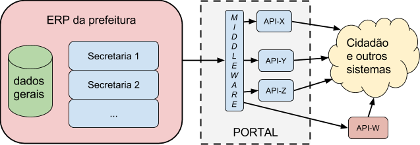
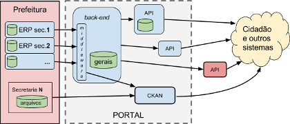

# RECOMENDAÇÕES PARA O *BACK-END* DE UM PORTAL DA TRANSPARÊNCIA MUNICIPAL

## Recomendações gerais
As recomendações foram divididas em [RFCs](rfcs.md): aquelas que foram votadas como pertinentes e relevantes, foram revisadas e publicadas como parte deste projeto:

* [**RFC 00** - Predefinições deste projeto](rfc00.md): introduz conceitos e permite a prefeitura reconhecer, entre  os modelos de referência, o mais compatível com a sua realidade. 

* [**RFC 01** - Padrões *data-interchange* recomendados](rfc01.md): recomendações gerais mais rígidas, de obediência aos padrões nacioais e interncionais adequados a um Portal e o acesso a dados abertos.

* [**RFC 02** - Modelo de referência para um Portal da Transparência do Município](rfc02.md): ... em construção. 

* [**RFC 03** - Requisitos adicionais](#): ainda não definida.

Todas as RFCs fazem use de termos e conceitos adotados especificamente para o contexto deste projetos, conforme *RFC&#160;00*.

Uma prefeitura já bem informatizada e integrada em torno de um sistema tipo ERP, pode demandar apenas um *middleware* simples no *back-end* do seu Portal, 

&#160;&#160;&#160; 

No caso geral, de qualquer forma, coexistem diversos sistemas e necessidades, exigindo uma arquitetura de Portal da Transparência um pouco mais complexa, e consequentemente *back-end* mais robusto:

&#160;&#160;&#160; 

## Recomendações específicas

Municípios com recomendações mais específicas:

* ... Recomendações para o back-end do Portal de Transparência do município de São Paulo ...
* ... outros municípios ...

## Sobre as recomendações

* O código-fonte e a descrição do coletivo mantenedor das recomendações, são mantidos em [github.com/CPT-PC/backend-portal-transparencia](https://github.com/CPT-PC/backend-portal-transparencia).

*  [**RFCs** - Redação e controle de versões](rfcs.md): os procedimentos de sugestão e aprovação das recomendações são descritos junto com os esclarecimentos sobre redação e controle das RFCs.

* Referências bibliográficas e outras fontes: está previsto o preparo uma RFC para isso, por hora apenas uma lista informal na Wiki.
