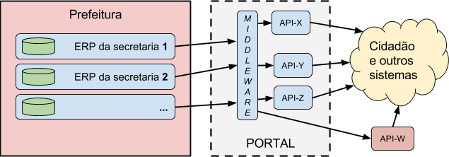
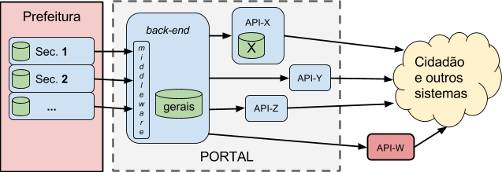
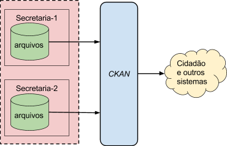

&#160; (série "[Request For Comments](rfcs.md) **deste projeto**")

# RFC 00 - (texto expandido)  Predefinições e modelo de maturidade da prefeitura

RESUMO: define-se alguns elementos do jargão adotado na RFCs, e um "menu" para posicionamento da prefeitura dentro de uma classificação de tipos de demanda e níveis de maturidade.  Para texto em versão enxuta consultar [**rfc00**](rfc00.md). 

[EM DISCUSSÃO E VOTAÇÃO NA *ISSUE*-11](https://github.com/CPT-PC/backend-portal-transparencia/issues/11).

--------

## Terminologia adotada

A adoção de alguns termos e conceitos pressupõe um *modelo de referência* da própria prefeitura, conforme seu grau de informatização, e uma visão consensual sobre como diferentes sistemas podem se conectar e interoperar. Os conceitos abresentados também fazem uma certa simplificação da realidade, para viabilizar a sua descrição.

* **modelo de referência**: recurso descritivo para prover fundamentos e entendimentos consensuais de um tema, contextualizando sistemas e estabelecendo arquiteturas padronizadas. Exemplos: [*OSI model*](https://en.wikipedia.org/wiki/OSI_model), [*OGC Reference Model*](http://rap.opengeospatial.org/orm.php).

* Toda prefeitura é composta de **secretarias** (ex. Saúde, Obras e Educação), que é uma espécie de "divisão por assunto". Além delas há algo como o *gabinete*, que faz o papel de "secretaria central".

* Prefeituras maiores podem ser regionalizadas ("divisão espacial"): divididas em distritos e subprefeituras, ou ainda administrações regionais. Podemos adotar o rótulo **subprefeitura** para todas essas denominações.

* **grau de maturidade informática**: descreve a capacidade técnica e de infraestrutura em TI, podendo variar entre  *alta*, *média* ou *baixa*. Uma prefeitura que investe, tem uma boa equipe de TI, e garante o suporte e infraestrutura de informática, pode ser classificada como *madura* (*alto* grau).

* **grau de abrangência da informatização**: descreve o quanto de fato a prefeitura encontra-se informatizado e quaal a sua capacidade de atendimento. Abrangência *alta* (~100%), *média* (~50%) ou *baixa* (menos de 10%).

* **ERP** da prefeitura:  sistema de gestão unificada da prefeitura, que centraliza todos os dados e automatiza todos os processos burocráticos e de utilização dos dados. Sistemas dessa natureza são em geral designados [ERP (sigla do inglês *Enterprise Resource Planning*)](https://en.wikipedia.org/wiki/Enterprise_resource_planning). Hoje em dia cidades com mais de 200 mil habitantes requerem implantação de ERP, não se pode gerenciar uma cidade apenas com planilhas.

* **Catálogo** de dados da prefeitura: aplicação Web de catalogação de dados para organização, identificação e publicação de *dados abertos* na forma de arquivos. Referência mais popular, [CKAN](http://docs.ckan.org/). Para conteúdos legislativos e jurídicos o grande catálogo brasileiro é o [LexML](http://www.lexml.gov.br/).

* **Preservação digital**: garantir que os dados continuem existindo, intactos e corretamente identificados, por anos (!) pode ser uma promesssa difícil de se cumprir. Hoje no Brasil o único repositório orientado à transparência e preservação é o [LexML](http://www.lexml.gov.br/), que garante apenas o acervo de metadados e os recursos de identificação de documentos legislativos e jurídicos. Uma das poucas tecnologias para preservação de documentos em seu inteiro teor é a  [LOCKSS](https://en.wikipedia.org/wiki/LOCKSS), utilizado no Brasil pelo SciELO para o acervo de artigos científicos.

* *back-end* e *front-end* de um sistema: noção utilizada na descrição de sistemas de software, para a separação das duas principais preocupações da equipe de desenvolvimento, ou uma visão dos seus módulos principais:
  *  ***front-end***: é a parte do sistema que se preocupa mais diretamente com o usuário final, com a interface do sistema e a forma como os dados serão visualizados ou acessados.
  *  ***back-end***: é o restante do sistema, em geral mais associado à base de dados ou ao processamento das fontes de dados.

### Hipóteses de trabalho

Definidos os termos, resta definir algumas hipóteses (simplificadoras) de trabalho:

* Supondo  que dados são consolidados "por assunto" e pelas secretarias, com o aspecto regional (subprefeituras) subordinado ao assunto (tratado como atributo), pode-se convencionar que  **a secretaria é a autoridade do dado** apresentado num Portal da Transparência.

* Quando não for indicado o contrário, supor que a prefeitura em questão tem *informatização madura e abrangente*.

Tendo esse pequeno jargão descritivo das prefeituras, podemos então falar das decisões racionais que elas tenderiam a tomar.

## Modelo de referência da prefeitura

A descrição simplificada da infraestrutura de informática de uma prefeitura, e das fontes de dados oferecidas por ela, requer que se avaliem os  graus de *maturidade* e *abrangência* da sua informática. Conforme o resultado de avaliação será recomendando um tipo de "arquitetura de portal" diferente, assimo como considerações e definições de *back-end* diferentes.

Sistema (ERP)   | Maturidade | Abrangência | Arquitetura recomendado
--------- | ---------  | ----------- | ----------------
unificado | alta | alta | tipo-1 ou 4
disperso  | alta | alta | tipo-2 ou 4 
ausente (‡)  | alta | alta | tipo-3
unificado | média ou baixa | média  | tipo-2 ou 4
disperso  | média ou baixa | média  | tipo-4
unificado | baixa | baixa | tipo-3 ou 4
disperso  | média | baixa | tipo-4
ausente  | média ou baixa | média ou baixa | tipo-3 ou 4

&#160; (‡) apesar de possível em prefeituras maduras, a ausência de ERP só faz sentido em municípios muito pequenos.

RESUMO DAS RECOMENDAÇÕES:

* tipo-1:  utilizar diretamente o *ERP da prefeitura* diretamente, como *back-end* do Portal da Transparência. 

* tipo-2: para agregar os diversos "ERPs das secretarias" através de um software desenvolvido mais especificamente para isso, que consistirá no *back-end* do Portal.

* tipo-3: (ficar só com o CKAN) apenas quando não há outra opção. 

* tipo-4: garante que nada fique de fora, mas a escolha pode depender de uma avaliação técnica mais apurada.

A seguir a descrição ilustrada de cada uma dessas arquiteturas recomendadas, e como o *back-end* se encontra nelas estruturado.

Tipo 1 - Dados centralizados
============================

Esse tipo de arquitetura ocorre quando a prefeitura consegue centralizar todos os dados em um só sistema, tipicamente um [sistema ERP](https://www.wikidata.org/wiki/Q131508), utilizado por todas as secretarias.

Tipo 1A - Direto
----------------

Utiliza o próprio ERP como *back-end*, e um de seus módulos (encarregado da publicação dos dados na Web) faz papel de *front-end* do Portal da Transparência.

Tipo 1B - Isolado por agregador
-------------------------------

Entre o ERP e o Portal tem apenas um pequeno  *middleware* agregador dos dados, filtrando e traduzindo para os padrões do Portal.  É suposta uma arquitetura orientada a serviços ([SOA](https://www.wikidata.org/wiki/Q220644)), centrada no *middleware*, o qual se comporta como *back-end* para alimentar uma série de APIs (mais dedicadas ao *front-end*).

Na ilustração a API-W lembra que a arquitetura SOA permite inclusive suprir, indiferentemente, a APIs externas, de outros portais.

Tipo 1C - Isolado por subsistema persistente
--------------------------------------------

Acrescentando-se requisitos de "persistência de dados" (legados, versões, etc.), o *middleware* do Tipo-1B se transforma num sistema completo.

Dados típicos a serem armazenados numa API, como ilustrado pela API-X, são dados relativos à autenticação de usuários, e conteúdos armazenados das discussões da comunidade usuária. Como veremos, não convém armazenar dados da prefeitura na API, o ideal é que fiquem todos no *back-end*.

Também foi ilustrado o caso da API-W, uma API externa que consome os dados do back-end do Portal, mas é orientada a outro front-end e mantida em infraestrutura de terceiros, externa à prefeitura. Organizações da imprensa e  terceiro setor são os principais mantenedores deste tipo de API, mas pode também ocorrer casos de centralização numa infraestrutura de esfera superior do próprio governo, como no caso do [LexML](http://www.lexml.gov.br/). Em ambos os casos, mesmo sendo externas, essas APIs podem ser previstas no projeto e na licitação do portal, através de modelos de contrato para a persistência do serviço externo (vide convênios entre prefeituras e LexML).

**Principais justificativas para a separação**

Justificativas para o isolamento técnico e independência contratual, obtidos da separação entre Portal e prefeitura, e entre *back-end* e as APIs do que compõe o *front-end* do Portal:

-   Entre sistema do Portal e sistema (ERP) da prefeitura:

	-   **segurança**: permite isolar o ERP, um sistema seguro em Intranet, da sua exposição pública na Web.

	-   **tráfego**: quando o middleware tem capacidade de armazenar dados (gerais para suprir qualquer API), ele isola também o ERP da demanda de acesso, ou seja, os dados são requisitados do ERP apenas uma vez, depois a Web estará acessando do seu banco de dados.

	-   **padronização**: o middleware converte dados específicos do ERP para os padrões fixados pelo Portal. Importante quando o ERP não tem um módulo específico para padronizar os dados conforme requisitos do portal, ou quando se preservar o investimento nesta padronização (evitando impacto da mudança de fornecedor do ERP).

	-   **bom negócio**: permite licitar/contratar o desenvolvimento ou manutenção do back-end sem impactar nas licitações das APIs e sem monopolizar o fornecimento em torno do fornecedor do ERP.

-   (dentro do Portal) Entre back-end e APIs:

	-   **interface final**: permite “plugar e desplugar” APIs (upgrades ou totalmente diferentes), sem compromenter o investimento na padronização dos dados.
	-   **arquitetura**: garante as vantagens de uma arquitetura SOA dentro do Portal.
	-   **bom negócio**: permite realizar contratos de desenvolvimento ou manutenção do front-end sem impactar no restante do Portal, assim como realizar contratos com APIs externas.

Tipo 2 - Dados dispersos
========================

Nas prefeituras que não dispõe de um ERP centralizando tudo, é comum que cada secretaria tenha seu próprio sistema (o "ERP da secretaria").

Tipo 2A - Agregados por middleware
----------------------------------

Tipo 2B - Agregados por sistema com persistência
------------------------------------------------

Tipo 3 - Sem sistema
====================

Numa prefeitura com baixa informatização, o portal se resumo a um sistema do tipo [CKAN](http://ckan.org/), publicando diretamente as planilhas e demais arquivos que as secretarias  disporem.

Tipo 4 - Mix de secretarias com e sem sistema
=============================================

Na prática, a maior parte das prefeituras não é nem tão ruim nem tão perfeita, e todas as demandas coexistem, resultando numa demanda por arquitetura híbrida das anteriores (tipos 1 a 3), portanto um pouco mais complexa.

