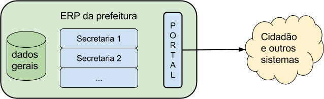
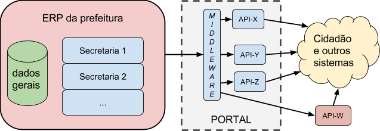
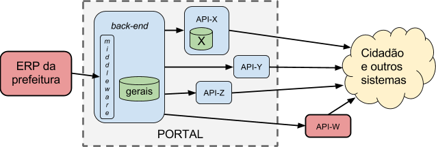
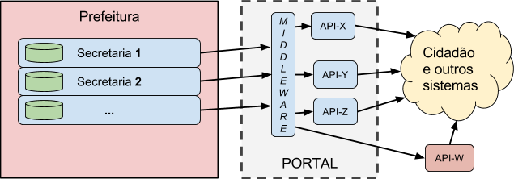
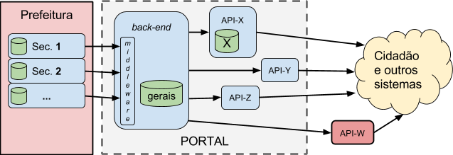
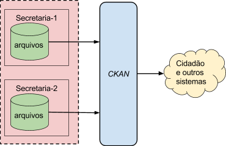
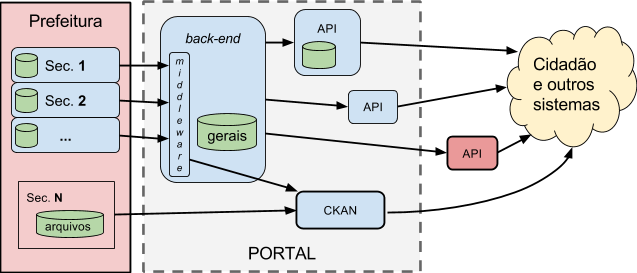

&#160; (série "[Request For Comments](https://en.wikipedia.org/wiki/Request_for_Comments) **desta iniciativa**)

#RFC 00 - Predefinições e modelo de maturidade na informatização da prefeitura

RESUMO: define-se alguns elementos do jargão adotado na RFCs, e um "menu" para posicionamento da prefeitura dentro de uma classificação de tipos de demanda e níveis de maturidade. Detalhes em [rfc00-detalhes](rfc00-detalhes.md). 

[EM DISCUSSÃO E VOTAÇÃO NA *ISSUE*-11](https://github.com/CPT-PC/backend-portal-transparencia/issues/11).

--------

Terminologia adotada
============================
....

Modelo de referência da prefeitura
============================

...

A seguir possíveis arquiteturas dentro do modelo de referência.

Tipo 1 - Dados centralizados
============================

É o sonho, quando a prefeitura consegue centralizar todos os dados em um só sistema, sendo utilizado por todas as secretarias, tipicamente um [sistema ERP](https://www.wikidata.org/wiki/Q131508) adaptado às especificidades da prefeitura  (portanto também um [GRP](https://www.wikidata.org/wiki/Q25712511)). Em algumas prefeituras o sonho já é realidade, mesmo assim há que se avaliar qual a arquitetura ideal para “plugar” o ERP com o Portal, e quais os prós e contras de se deixar o Portal a cargo da empresa fornecedora do ERP, ou garantir que o Portal seja mais independente.

Tipo 1A - Direto
----------------

O sonho é ter um só sistema (um “ERP do setor público”)  sendo usado por todas as secretarias e tendo além disso um módulo para a publicação na Web. O próprio ERP faz papel de back-end.

Dentro do ERP cada secretaria tem seus dados, seus módulos específicos de interação, etc.

Esse sonho até existe em algumas prefeituras, mas em geral a publicação na Web, orientada ao público e à transparência, tem requisitos e funcionalidades muito específicos, e requerem um pacote intermediário, o middleware, para realizar a tarefa...

Tipo 1B - Isolado por agregador
-------------------------------

Na prática, numa arquitetura orientada a serviços (SOA), esse middleware se comporta como back-end para alimentar uma série de APIs mais dedicadas ao front-end.

Na ilustração a API-W lembra que a arquitetura SOA permite inclusive suprir, indiferentemente, a APIs externas, de  outros portais.

Tipo 1C - Isolado por subsistema persistente
--------------------------------------------

Quando surgem requisitos de persistência dos dados legados, de armazenamento de diferentes versões, ou mesmo de armazenamento em cache, acrescentam-se à arquitetura novas bases de dados, que podem estar no back-end, na API ou ainda fora do portal. Como há uma grande diversidade de demandas, todas essas opções podem estar presentes no Portal.

Quando o Portal da Transparência tem requisitos de persistência e controle de versão dos dados publicados, o middleware se transforma num sistema completo, com seu próprio banco de dados para os seus caches e backups

Dados típicos a serem armazenados numa API, como ilustrado pela API-X, são dados relativos à autenticação de usuários, e armazenamento de comentários e discussões. Como veremos, não convém armazenar dados da prefeitura na API, o ideal é que fiquem todos no back-end.

Também foi ilustrado o caso da API-W, uma API externa que consome os dados do back-end do Portal, mas é orientada a outro front-end e mantida em infraestrutura de terceiros, externa à prefeitura. Organizações da imprensa e  terceiro setor são os principais mantenedores deste tipo de API, mas pode também ocorrer casos de centralização numa infraestrutura de esfera superior do próprio governo, como no caso do LexML. Em ambos os casos, mesmo sendo externas, essas APIs podem ser previstas no projeto e na licitação do portal, através de modelos de contrato para a persistência do serviço externo (vide convênios entre prefeituras e LexML).

Principais justificativas para a separação

No isolamento técnico e independência contratual, entre Portal e prefeitura e entre back-end e as APIs do que compõe o front-end do Portal:

-   Entre sistema do Portal e sistema (ERP) da prefeitura:

	-   segurança: permite isolar o ERP, um sistema seguro em Intranet, da sua exposição pública na Web.
	-   tráfego: quando o middleware tem capacidade de armazenar dados (gerais para suprir qualquer API), ele isola também o ERP da demanda de acesso, ou seja, os dados são requisitados do ERP apenas uma vez, depois a Web estará acessando do seu banco de dados.
	-   padronização: o middleware converte dados específicos do ERP para os padrões fixados pelo Portal. Importante quando o ERP não tem um módulo específico para padronizar os dados conforme requisitos do portal, ou quando se preservar o investimento nesta padronização (evitando impacto da mudança de fornecedor do ERP).
	-   bom negócio: permite licitar/contratar o desenvolvimento ou manutenção do back-end sem impactar nas licitações das APIs e sem monopolizar o fornecimento em torno do fornecedor do ERP.

-   (dentro do Portal) Entre back-end e APIs:

	-   interface final: permite “plugar e desplugar” APIs (upgrades ou totalmente diferentes), sem compromenter o investimento na padronização dos dados.
	-   arquitetura: garante as vantagens de uma arquitetura SOA dentro do Portal.
	-   bom negócio: permite realizar contratos de desenvolvimento ou manutenção do front-end sem impactar no restante do Portal, assim como realizar contratos com APIs externas.

Tipo 2 - Dados dispersos
========================

Nas prefeituras que não dispõe de ERP geral, centralizando tudo, mas ainda assim se encontram bem informatizadas, é comum que cada secretaria tenha seu próprio sistema, que pode ser imaginado como um "ERP da secretaria".

Tipo 2A - Agregados por middleware
----------------------------------

Tipo 2B - Agregados por sistema com persistência
------------------------------------------------

Tipo 3 - Sem sistema
====================

Por fim, nas prefeituras menos informatizadas não há como automatizar a entrega dos dados, existem apenas arquivos, e apenas eles podem ser publicados, fazendo uso por exemplo do CKAN. Neste caso o Portal da Transparência se resume ao CKAN.

Tipo 4 - Mix de secretarias com e sem sistema
=============================================

Na prática, por fim, não é nem tão ruim nem tão perfeito, e todas as demandas coexistem na prefeitura...

Como existem APIs externas de transparência, tais como o LexML, assim como APIs do terceiro setor que também oferecem ferramentas de auditoria com base nos dados publicados pelo portal (ex. Gastos Abertos), há que se levar em conta que algumas APIs nem precisam ser mantidas pela prefeitura.

No  caso da API externa estar cumprindo uma parte dos requisito do portal (ex. LexML cumpre requisitos de catálogo legislativo), basta garantir que o consumo que fazem do Portal seja reforçado por um contrato de persistência  de ambas as partes.

