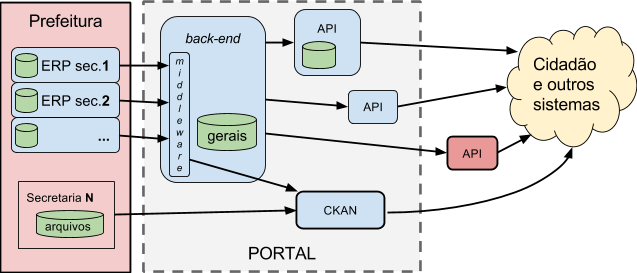

&#160; (série "[Request For Comments](https://en.wikipedia.org/wiki/Request_for_Comments) **desta iniciativa**)

#RFC 00 - Predefinições e modelo de maturidade na informatização da prefeitura

RESUMO: define-se alguns elementos do jargão adotado na RFCs, e um "menu" para posicionamento da prefeitura dentro de uma classificação de tipos de demanda e níveis de maturidade. Detalhes em [**rfc00-detalhes**](rfc00-detalhes.md). 

[EM DISCUSSÃO E VOTAÇÃO NA *ISSUE*-11](https://github.com/CPT-PC/backend-portal-transparencia/issues/11).

--------

## Terminologia adotada

Termos e conceitos relativos a uma visão simplificada da  prefeitura.

* **secretaria**: por exemplo  Saúde, Obras e Educação. O *gabinete* faz o papel de "secretaria central".

* **subprefeitura**: subdivisão espacial da prefeitura, para fins de administração regional (distrito). É suposto, a título de simplificação, que os dados de subprefeituras são consolidados nas secretarias.

* **grau de maturidade informática**: descreve a capacidade técnica e de infraestrutura em TI, maturidade *alta*, *média* ou *baixa*.

* **grau de abrangência da informatização**: descreve o quanto de fato a prefeitura encontra-se informatizado. Abrangência *alta* (~100%), *média* (~50%) ou *baixa* (menos de 10%).

* **ERP** da prefeitura: sistema de software do tipo [ERP (sigla do inglês *Enterprise Resource Planning*)](https://en.wikipedia.org/wiki/Enterprise_resource_planning) utilizado na gestão e automação de processos da prefeitura.

* **Catálogo** de dados da prefeitura: aplicação Web de catalogação de dados para organização, identificação e publicação de *dados abertos* na forma de arquivos. Referência mais popular, [CKAN](http://docs.ckan.org/). Para conteúdos legislativos e jurídicos o grande catálogo brasileiro é o [LexML](http://www.lexml.gov.br/).

* **Preservação digital**: recursos e processos que garantem a preservação de longo prazo (anos) dos dados da prefeitura, intactos e corretamente identificados. Referências: [LexML](http://www.lexml.gov.br/) na preservação de metadados legislativos e jurídicos;  [LOCKSS](https://en.wikipedia.org/wiki/LOCKSS) na preservação de documentos oficiais.

## Modelo de referência da prefeitura

A descrição simplificada da infraestrutura de informática de uma prefeitura, e das fontes de dados oferecidas por ela, requer que se avalie a  prefeitura dentro de um quadro classificatório dos graus de *maturidade* e *abrangência* da informática. Conforme cada resultado de avaliação será recomendando um tipo de *back-end* diferente.

Sistema (ERP)   | Maturidade | Abrangência | Back-end recomendado
--------- | ---------  | ----------- | ----------------
unificado | alta | alta | tipo-1 direto
disperso  | alta | alta | tipo-2 agregador
ausente (‡)  | alta | alta | tipo-3
unificado | média ou baixa | média  | tipo-3
disperso  | média ou baixa | média  | tipo-3
unificado | baixa | baixa | tipo-4
disperso  | média | baixa | tipo-4
ausente  | média ou baixa | média ou baixa | tipo-4

Cada um dos tipos é descrito a seguir.

Tipo 1 - Dados centralizados
============================

Ocorre quando a prefeitura consegue centralizar todos os dados em um só sistema, sendo utilizado por todas as secretarias, tipicamente um [sistema ERP](https://www.wikidata.org/wiki/Q131508) adaptado às especificidades da prefeitura  (portanto também um [GRP](https://www.wikidata.org/wiki/Q25712511)).

Tipo 1A - Direto
----------------

Caracteriza-se por ter um só sistema (ERP) em uso para todas as secretarias, e tendo além disso um módulo para a publicação na Web. O próprio ERP faz papel de back-end.

Tipo 1B - Isolado por agregador
-------------------------------

Forma mais simples de isolamemto do ERP, numa arquitetura orientada a serviços (SOA), centrada no *middleware*, o qual se comporta como *back-end* para alimentar uma série de APIs (mais dedicadas ao *front-end*).

Na ilustração a API-W lembra que a arquitetura SOA permite inclusive suprir, indiferentemente, a APIs externas, de outros portais.

Tipo 1C - Isolado por subsistema persistente
--------------------------------------------

Acrescentando-se requisitos de "persistência de dados" (legados, versões, etc.), o *middleware* do Tipo-1C se transforma num sistema completo.

Tipo 2 - Dados dispersos
========================

Nas prefeituras que não dispõe de um ERP centralizando tudo, é comum que cada secretaria tenha seu próprio sistema (o "ERP da secretaria").

Tipo 2A - Agregados por middleware
----------------------------------

Tipo 2B - Agregados por sistema com persistência
------------------------------------------------

Tipo 3 - Sem sistema
====================

Por fim, nas prefeituras menos informatizadas não há como automatizar a entrega dos dados, existem apenas arquivos, e apenas eles podem ser publicados, fazendo uso por exemplo do CKAN. Neste caso o Portal da Transparência se resume ao CKAN.

Tipo 4 - Mix de secretarias com e sem sistema
=============================================

Na prática, não é nem tão ruim nem tão perfeito, e todas as demandas coexistem na prefeitura.

