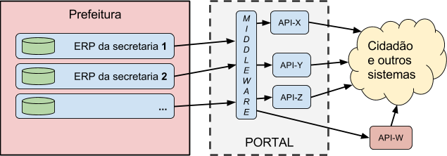

&#160; (série "[Request For Comments](rfcs.md) **deste projeto**")

#RFC 00 - Predefinições e modelo de maturidade na informatização da prefeitura

RESUMO: define-se alguns elementos do jargão adotado na RFCs, e um "menu" para posicionamento da prefeitura dentro de uma classificação de tipos de demanda e níveis de maturidade. Detalhes em [**rfc00-expandida**](rfc00-expandida.md). 

[EM DISCUSSÃO E VOTAÇÃO NA *ISSUE*-11](https://github.com/CPT-PC/backend-portal-transparencia/issues/11).

--------

## Escopo e conceitos básicos
Apesar da complexidade do tema, há como se expressar e discutir o assunto com base em alguns conceitos norteadores:

> O governo municipal precisa ser ***transparente*** quanto aos seus ***atos*** e as suas ***contas***. Transparente no sentido de "*publicar* para todo mundo ver" e também "para poder ser *auditado* por todos".

* **Transpante**: significa que dados e conteúdos são simultaneamente  *publicados* no Diário Oficial e na Internet, cumprindo o amplo acesso previsto pela LAI. Para "poder ser [*auditado*](https://www.wikidata.org/wiki/Q181487)", requer também que os dados e conteúdos estejam em [formatos abertos](http://5stardata.info/pt-BR/), e que haja *consistência* entre os diversos itens de dados, metadados ou conteúdos publicados (ver ilustração abaixo).

* **Atos**: leis, decretos, portarias, licitações e contratos, são *atos*, expressos na forma de documentos, podendo originar simultaneamento conteúdos (ex. texto), dados (ex. tabelas) e metaddos (extraídos do texto ou complementando ele).
   * Os metadados permitem auditar a consistência entre *atos* e *contas*, além de identificar univocamente cada *ato* e formalizar outros relacionamentos.
   * O conteúdo tem  os requisitos jurídicos resolvidos com a publicação no [Diário Oficial](https://www.wikidata.org/wiki/Q2065227) (PDF). 
   * A *transparência* do conteúdo fica completa com a publicação na Internet (HTML), apoiada pelo uso dos metadados  (publicação no [LexML](http://www.lexml.gov.br/)).
  
* **Contas**: relativas a receitas, despesas, orçamentos, empenhos, arrecadações e execuções, [todas](http://transparencia.prefeitura.sp.gov.br/contas/Documents/Receitas_detalhamento_municipal.pdf) são dados dentro do *ERP da prefeitura*, ou de planilhas. Já circulam na contabilidade da prefeitura com certa *padronização*, portanto basta que sejam fornecidas para a publicação na Internet, idealmente como [CSV do *tabular-data-model*](https://www.w3.org/TR/tabular-data-model/) e consistentes com os *atos*. Estes são os chamados "dados brutos", mas, ainda por questões de *transparência*, por requisitos de *auditoria* e acessibilidade, as *contas* devem também consolidados, sumarizados e filtradas:

  * organizadas por etapas, tais como planejamento/execução ou  planejado/empenhado/liquidado, etc.
  * sumarizadas em totais, subtotais, etc. 
  * filtradas por ano, secretaria,  local, rúbrica, origem, etc. ou consolidadas por contrato, secretaria, etc.

&#160;&#160;&#160; 

-----

## Terminologia adotada

Termos e conceitos relativos a uma visão simplificada da  prefeitura.

* **secretaria**: por exemplo  Saúde, Obras e Educação. O *gabinete* faz o papel de "secretaria central".

* **subprefeitura**: subdivisão espacial da prefeitura, para fins de administração regional (distrito). É suposto, a título de simplificação, que os dados de subprefeituras são consolidados nas secretarias.

* **grau de maturidade informática**: descreve a capacidade técnica e de infraestrutura em TI, maturidade *alta*, *média* ou *baixa*.

* **grau de abrangência da informatização**: descreve o quanto de fato a prefeitura encontra-se informatizado. Abrangência *alta* (~100%), *média* (~50%) ou *baixa* (menos de 10%).

* **ERP** da prefeitura: sistema de software do tipo [ERP (sigla do inglês *Enterprise Resource Planning*)](https://en.wikipedia.org/wiki/Enterprise_resource_planning) utilizado na gestão e automação de processos da prefeitura.

* **Catálogo** de dados da prefeitura: aplicação Web de catalogação de dados para organização, identificação e publicação de *dados abertos* na forma de arquivos. Referência mais popular, [CKAN](http://docs.ckan.org/). Para conteúdos legislativos e jurídicos o grande catálogo brasileiro é o [LexML](http://www.lexml.gov.br/).

* **Preservação digital**: recursos e processos que garantem a preservação de longo prazo (anos) dos dados da prefeitura, intactos e corretamente identificados. Referências: [LexML](http://www.lexml.gov.br/) na preservação de metadados legislativos e jurídicos;  [LOCKSS](https://en.wikipedia.org/wiki/LOCKSS) na preservação de documentos oficiais.

[Mais detalhes](rfc00-expandida.md#terminologia-adotada).

## Modelo de referência da prefeitura

A descrição simplificada da infraestrutura de informática de uma prefeitura, e das fontes de dados oferecidas por ela, requer que se avalie a  prefeitura dentro de um quadro classificatório dos graus de *maturidade* e *abrangência* da informática. Conforme cada resultado de avaliação será recomendando um tipo de *back-end* diferente.

Sistema (ERP)   | Maturidade | Abrangência | Arquitetura recomendado
--------- | ---------  | ----------- | ----------------
unificado | alta | alta | tipo-1 ou 4
disperso  | alta | alta | tipo-2 ou 4 
ausente   | alta | alta | tipo-3
unificado | média ou baixa | média  | tipo-2 ou 4
disperso  | média ou baixa | média  | tipo-4
unificado | baixa | baixa | tipo-3 ou 4
disperso  | média | baixa | tipo-4
ausente  | média ou baixa | média ou baixa | tipo-3 ou 4

Cada um dos tipos é descrito a seguir.

Tipo 1 - Dados centralizados
============================

Esse tipo de arquitetura ocorre quando a prefeitura consegue centralizar todos os dados em um só sistema, tipicamente um [sistema ERP](https://www.wikidata.org/wiki/Q131508), utilizado por todas as secretarias.

Tipo 1A - Direto
----------------

Utiliza o próprio ERP como *back-end*, e um de seus módulos (encarregado da publicação dos dados na Web) faz papel de *front-end* do Portal da Transparência.

Tipo 1B - Isolado por agregador
-------------------------------

Entre o ERP e o Portal tem apenas um pequeno  *middleware* agregador dos dados, filtrando e traduzindo para os padrões do Portal.  É suposta uma arquitetura orientada a serviços ([SOA](https://www.wikidata.org/wiki/Q220644)), centrada no *middleware*, o qual se comporta como *back-end* para alimentar uma série de APIs (mais dedicadas ao *front-end*).

Na ilustração a API-W lembra que a arquitetura SOA permite inclusive suprir, indiferentemente, a APIs externas, de outros portais.

Tipo 1C - Isolado por subsistema persistente
--------------------------------------------

Acrescentando-se requisitos de "persistência de dados" (legados, versões, etc.), o *middleware* do Tipo-1B se transforma num sistema completo.

[Mais detalhes](rfc00-expandida.md#tipo-1a---direto).

Tipo 2 - Dados dispersos
========================

Nas prefeituras que não dispõe de um ERP centralizando tudo, é comum que cada secretaria tenha seu próprio sistema (o "ERP da secretaria").

Tipo 2A - Agregados por middleware
----------------------------------

Tipo 2B - Agregados por sistema com persistência
------------------------------------------------

Tipo 3 - Sem sistema
====================

Numa prefeitura com baixa informatização, o portal se resumo a um sistema do tipo [CKAN](http://ckan.org/), publicando diretamente as planilhas e demais arquivos que as secretarias  disporem.

Tipo 4 - Mix de secretarias com e sem sistema
=============================================

Na prática, a maior parte das prefeituras não é nem tão ruim nem tão perfeita, e todas as demandas coexistem, resultando numa demanda por arquitetura híbrida das anteriores (tipos 1 a 3), portanto um pouco mais complexa.

