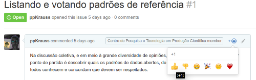

&#160; (série "Request For Comments" **deste projeto**)

#RFCs - Redação e controle de versões

As "[Request For Comments](https://en.wikipedia.org/wiki/Request_for_Comments)" (**RFC**s) deste projeto são um pequeno conjunto de documentos criados a partir da discussão do coletivo que o mantém, para fins de registro de consenso, e para expor redomendações.

## Passo-a-passo da criação de uma RFC

 1. Rotular entre as  [*issues*](https://github.com/CPT-PC/backend-portal-transparencia/issues) quais são [aquelas que são candidatas a RFC](https://github.com/CPT-PC/backend-portal-transparencia/issues?q=is%3Aissue+is%3Aopen+label%3A%22sugest%C3%A3o+de+RFC%22) (recebem o *label* "sugestão de RFC").

 2. Votar nas *issues* candidatas a RFC. 

 3. Se a RFC-candidata receber mais do que 2 votos, e 50%+1 dos votos forem positvos, um voluntário é requisitado ser redator da RFC.

 4. Uma versão rascunho é desenvolvida e, assim que seu status passa a "EM REVISÃO" todos são convidados a discutir e fazer alterações.

 5. Finalizada a discussão e as melhoras, o redator passa o status para "EM VOTAÇÃO", ou seja, abre-se uma nova votação simultaneamente com um post na *issue* também indiando "EM VOTAÇÃO". Os votos serão realizados sob este post.

 6. Se aprovada, o redator indica o número de votos no `endorsed_n` e a `vers` como *1.0*.  NOTA: em casos especiais, quando a RFC for muito longa, sugere-se quebra do documento em duas versões, uma simplificada (arquivo `rfcXX`) e uma expandida (arquivi `rfcXX-expandida`), a exemplo do que foi feito com a [rfc00](rfc00.md).

 7. Acrescenta-se uma linha no [README principal](../README.md) do projeto, sob a seção "REDOMENDAÇÕES", com link para a RFC.

 8. ... são possíveis "merges" e revisões maiores, mas há que se registrar todo o processo numa *issue*.

## Estrutura básica do texto da RFC

Possui 3 partes

* Barra de *status*: uma pequena tabela (seguir modelo dos códigos-fonte já existentes) com os campos `type` (tipo de RFC), `vers` (versão), `vers_status` (status da versão), `endorsed_n` (número de apoiadores que endossaram a versão final), `endorsed_status` (indica se a versão requer espera ou já está aberta a endosso), `layout` (página ou planilha), `issue` (código da *issue* que deu origem à RFC).

* série, Título e Resumo: parte inicial do texto.

* corpo principal do texto.

